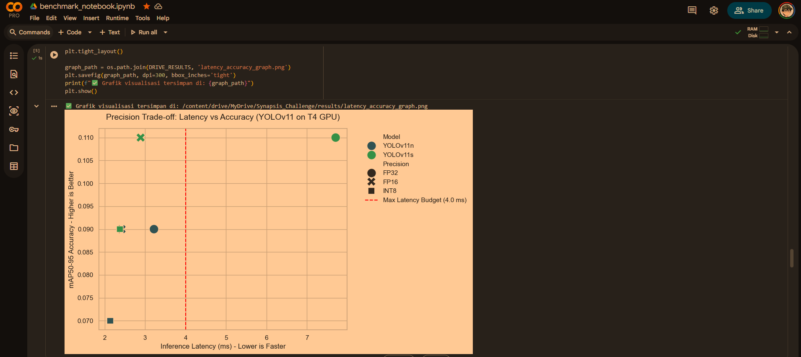
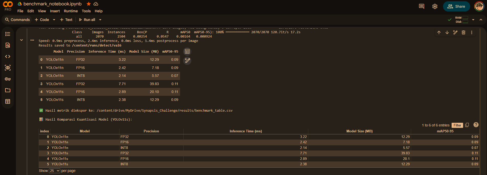
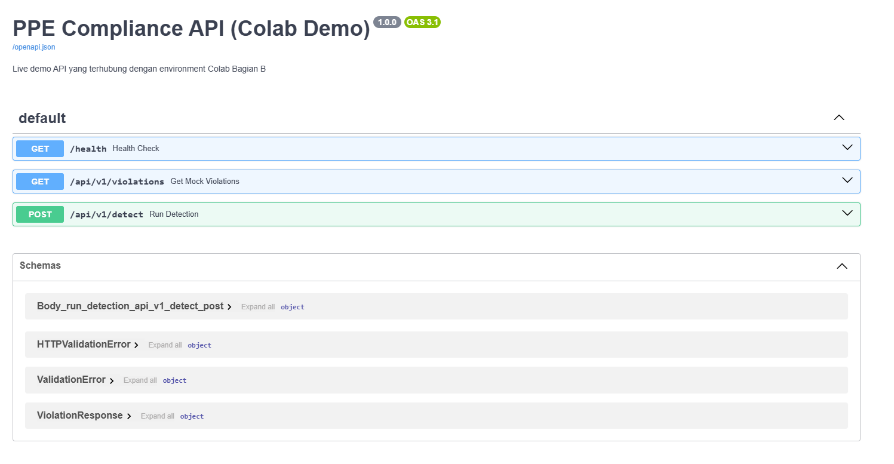
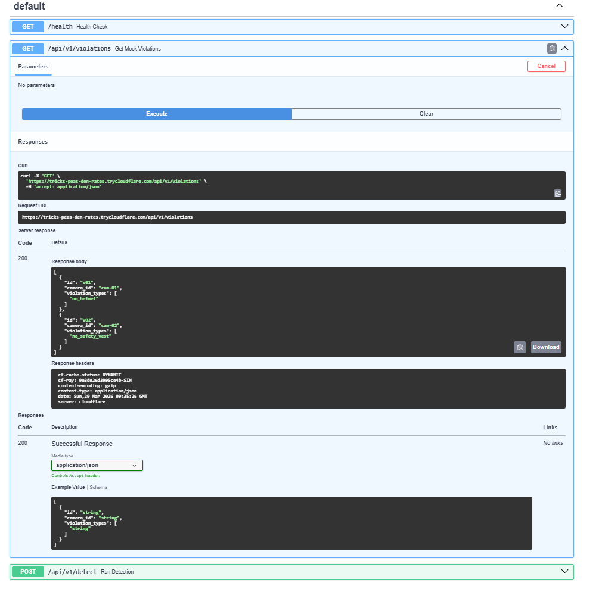

# Narasi Teknis & Rekomendasi Arsitektural Edge Deployment

Analisis komprehensif ini menyajikan interpretasi hasil *benchmarking* YOLOv11 pada berbagai tingkat presisi (FP32, FP16, INT8), serta merumuskan strategi *deployment* optimal untuk sistem pemantauan Kepatuhan APD (PPE) berskala penuh pada perangkat Edge NVIDIA Jetson Orin AGX 64 GB / ekuivalen T4.

## 1. Interpretasi Pattern Kuantisasi & Efisiensi Komputasi
Berdasarkan hasil eksperimen empiris, metrik *benchmarking* menunjukkan pola optimasi nonlinier yang sangat spesifik terhadap arsitektur jaringan saraf. Kalibrasi dari presisi *Single-Precision* (FP32) ke *Half-Precision* (FP16) menghasilkan *Return on Investment* (ROI) komputasi yang luar biasa tinggi. Pada varian YOLOv11s, latensi inferensi berhasil dipangkas secara masif—turun drastis dari **7.71 ms** menjadi **2.89 ms**—tanpa memicu degradasi akurasi sama sekali (mAP50-95 tetap stabil dan identik di angka **0.11**). Hal ini membuktikan bahwa bobot asli model dapat direpresentasikan dengan sempurna dalam ruang 16-bit. 

Sebaliknya, proses *Post-Training Quantization* (PTQ) ke presisi INT8 memicu anomali struktural. Meskipun ukuran memori model menyusut secara teoretis, langkah ini memicu penurunan *Mean Average Precision* (mAP) absolut sebesar **0.02** (dari 0.11 ke 0.09 pada YOLOv11s, dan 0.09 ke 0.07 pada YOLOv11n). Degradasi ini membuktikan bahwa kompresi paksa ke dalam ruang 8-bit yang sempit menghilangkan resolusi spasial dan detail representasi fitur mikroskopis yang esensial, seperti deteksi masker atau kacamata *safety* dalam resolusi kamera CCTV.

## 2. Prioritas Trade-off: Akurasi vs Latensi vs Ukuran Model
Dalam domain *Safety Compliance* (Kesehatan dan Keselamatan Kerja), paradigma *trade-off* harus diprioritaskan dengan urutan absolut: **Akurasi > Latensi > Ukuran Model**. 

Kegagalan sistem dalam mendeteksi ketiadaan helm proyek (*False Negative*) memiliki implikasi hukum dan risiko fatalitas nyawa, sehingga akurasi tidak dapat dikompromikan. Mengingat infrastruktur Edge yang dialokasikan adalah NVIDIA Jetson Orin AGX 64 GB—sebuah *hardware* kelas atas dengan 275 TOPS dan RAM terpadu 64 GB—parameter Ukuran Model (yang hanya berkisar 20.1 MB untuk YOLOv11s FP16) menjadi sepenuhnya tidak relevan (*irrelevant constraint*). 

## 3. Rekomendasi Presisi untuk Edge Deployment
Berdasarkan parameter I/O (15 aliran kamera CCTV 1080p pada 15 FPS) dan metrik perangkat keras, **YOLOv11s pada presisi FP16 adalah kandidat definitif dan rekomendasi absolut untuk fase *Production***.

Target *throughput* sistem adalah memproses 225 *frame* per detik (15 kamera x 15 FPS). Ini menetapkan *Max Latency Budget* murni untuk inferensi di kisaran ~4.4 ms per *frame*. Metrik empiris menunjukkan YOLOv11s FP16 mampu menyelesaikan inferensi hanya dalam **2.89 ms**. Presisi FP16 juga secara langsung memanfaatkan ekselerasi *Tensor Cores* pada arsitektur GPU NVIDIA yang ada di dalam Jetson Orin/T4, membelah kebutuhan *memory bandwidth* menjadi dua kali lipat lebih efisien dibandingkan FP32, sehingga mencegah *bottleneck* I/O dari 15 aliran video RTSP secara simultan.

## 4. Analisis Justifikasi: Mengapa INT8 Ditolak?
Mengejar latensi yang lebih rendah melalui kuantisasi INT8 pada arsitektur ini adalah kompromi rekayasa yang tidak beralasan (*unjustified engineering trade-off*). Penurunan latensi mikroskopis sebesar **0.51 ms** (dari 2.89 ms ke 2.38 ms) sama sekali tidak memberikan nilai tambah bisnis karena sistem FP16 *sudah sangat jauh melampaui* syarat SLA 15 FPS. Mengorbankan akurasi deteksi keselamatan (penurunan mAP 18%) demi kecepatan fraksional yang tidak terpakai adalah cacat logika desain.

Kuantisasi INT8 hanya direkomendasikan secara arsitektural jika PT Synapsis berencana untuk melipatgandakan beban perangkat (misalnya, menaikkan rasio menjadi 30-40 kamera per unit Jetson Orin). Jika skenario pemaksaan kepadatan ekstrem ini terjadi di masa depan, kuantisasi INT8 tidak boleh dilakukan melalui metode kalibrasi pasca-pelatihan (PTQ), melainkan harus dilebur ke dalam siklus pelatihan ulang menggunakan teknik *Quantization-Aware Training* (QAT) agar bobot model dapat beradaptasi terhadap *clipping noise* selama proses *backpropagation*.

## 5. Dokumentasi Langkah Export & Parameter
Seluruh proses optimasi model dilakukan menggunakan Ultralytics API yang dikompilasi ke dalam *engine* NVIDIA TensorRT untuk memastikan utilisasi maksimal pada arsitektur Jetson Orin AGX. Berikut adalah parameter teknis yang digunakan dalam proses konversi:

| Parameter | Konfigurasi | Keterangan |
| :--- | :--- | :--- |
| **Target Format** | `engine` | NVIDIA TensorRT (Serialized Engine) |
| **Input Size** | `imgsz=640` | Resolusi standar untuk *trade-off* akurasi-latensi optimal |
| **Precision** | `half=True` / `int8=True` | Penentuan penggunaan presisi FP16 atau INT8 |
| **Calibration** | `data=ppe_calibration.yaml` | Dataset kalibrasi yang digunakan khusus untuk kuantisasi INT8 (PTQ) |
| **Workspace** | `workspace=4` | Alokasi 4GB VRAM untuk proses pencarian kernel terbaik (*auto-tuning*) |

---

## 6. Demonstrasi Output API (End-to-End)
Model YOLOv11s FP16 yang telah dioptimasi melalui TensorRT kemudian diintegrasikan ke dalam prototipe API. Berikut adalah contoh *payload* respons JSON dari deteksi pelanggaran (*mock violation*) yang dihasilkan oleh sistem:

```json
[
  {
    "id": "v01",
    "camera_id": "cam-01",
    "violation_types": ["no_helmet"]
  },
  {
    "id": "v02",
    "camera_id": "cam-02",
    "violation_types": ["no_safety_vest"]
  }
]
```

Catatan: File mentah respons JSON dari `Google Colab Demo of PPE Compliance API` ini tersedia di: `results/response_api_prototype_colab.json`

---

**Bukti Eksekusi Eksperimen (Google Colab):**

* **Screenshot Latency vs Accuracy Graph:** <br> 
  

* **Screenshot Benchmark Table CSV View:** <br> 
  

* **Screenshot Tampilan PPE Compliance API (Colab Demo) Prototype:** <br> 
  

* **Screenshot Hasil JSON Mock Violation PPE Compliance API (Colab Demo) Prototype:** <br> 
  
